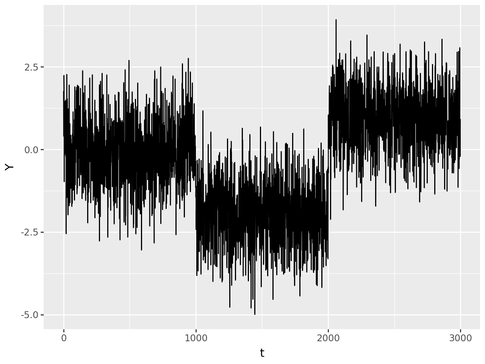
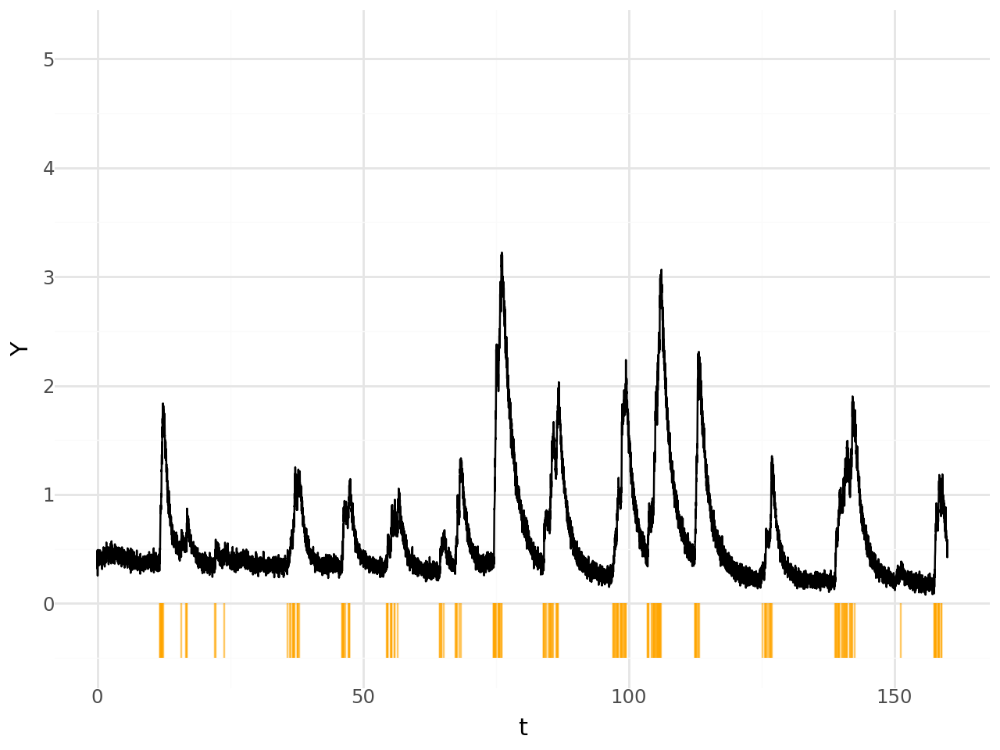
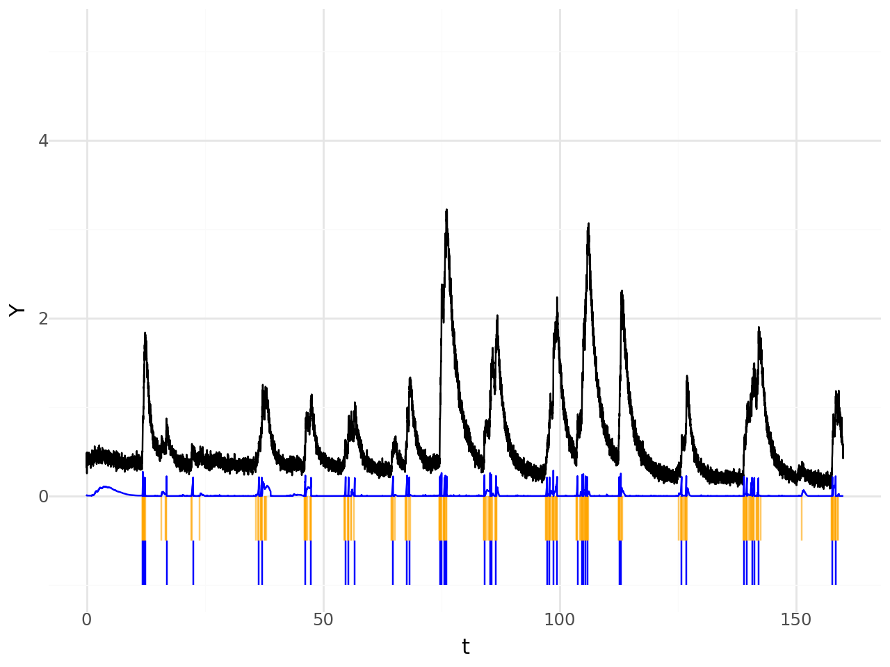
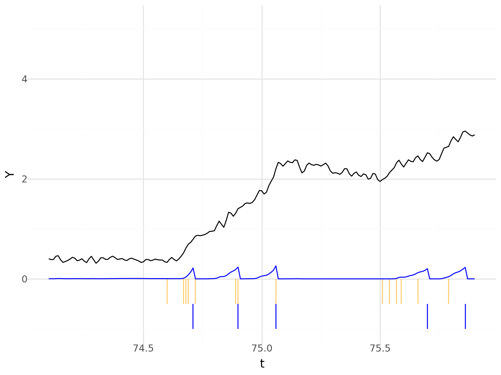

# Constrained Spike Inference Data Example


This notebooks shows an example of the constrained model for Focus. This
example is inspired from one application of changepoint detection to
spike inference in calcium imaging data. For past developments in the
offline setting, see [Jewell and
al. (2020)](https://academic.oup.com/biostatistics/article/21/4/709/5310127).

``` python
#!python -m pip install pandas
#!python -m pip install plotnine
#!python -m pip install ipywidgets
```

``` python
import numpy as np
import pandas as pd
from plotnine import ggplot, aes, geom_line, geom_vline, theme_minimal, xlim, geom_segment, geom_point
import plotnine as pl
from changepoint_online import *
import pickle
```

## An introductory example

To explain how to run the costrained recursion in focus, and see what
effects it has on the changepoint detections, we generate an artificial
example:

``` python
np.random.seed(0)
Y = np.concatenate((np.random.normal(loc=0.0, scale=1.0, size=1000),
                    np.random.normal(loc=-2.0, scale=1.0, size=1000),
                    np.random.normal(loc=1.0, scale=1.0, size=1000)))
```

``` python
df = pd.DataFrame({'t' : range(Y.size), 'Y': Y})
(ggplot(df, aes(x='t', y='Y')) +
        geom_line())
```



For detecting just up changes we can specify:

``` python
threshold = 10.0

detector = Focus(Gaussian(), side="right")
for y in Y:
    detector.update(y)
    if detector.statistic() >= threshold:
        break
detector.changepoint()
```

    {'stopping_time': 2009, 'changepoint': 2002}

Similarly, for detecting just down changes we can specify:

``` python
threshold = 10.0

detector = Focus(Gaussian(), side="left")
for y in Y:
    detector.update(y)
    if detector.statistic() >= threshold:
        break
detector.changepoint()
```

    {'stopping_time': 1008, 'changepoint': 1000}

## Constrained Up-Down model for spike inference

Now this constrained optimization can be useful for detecting spikes in
calcium-imaging data. In this context, a spike is equivalent to a neuron
firing. Following a spike we find an exponential decay.

``` python
with open("data/example_trace.pkl", "rb") as f:
    neur_trace = pickle.load(f)
```

Plotting the trace (and the real spike times, in orange below the
calcium trace):

``` python
# Define the y position for the segments
y_position = 0
plt_seg_range = -.5


# Create a new DataFrame for the spikes
df_spikes = pd.DataFrame({
    't': neur_trace["spikes"],
    'y': [y_position] * len(neur_trace["spikes"]),
    'yend': [y_position + plt_seg_range] * len(neur_trace["spikes"])
})

df = pd.DataFrame({'t' : neur_trace["time"], 'Y': neur_trace["trace"]})

(ggplot(df, aes(x='t', y='Y')) + 
    geom_line() + 
    geom_segment(df_spikes, aes(x = 't', xend = 't', y = 'y', yend = 'yend'), alpha = 0.6, colour = "orange") +
    xlim(0, 160)+
    theme_minimal()
)
```



We can run a two-states constrained model to keep track of the up state
and the decay state.  
To do so, at every iteration we run two changepoint detectors, one
focusing on the left-changes (decay) and one for the right-changes
(increase, equivalent to a neuron firing). Every time one of the two
detectors passes the relative threshold, we re-initialize the model.

``` python
# change this to focus on a smaller part of the trace
lower, upper = 0, len(neur_trace["trace"])
Y = neur_trace["trace"][lower:upper]
time = neur_trace["time"][lower:upper]

# thresholds for up and down changes
r_threshold = .2
l_threshold = 1

# init of the two detectors
r_detector = Focus(Gaussian(), side="right")
l_detector = Focus(Gaussian(), side="left")

cpt_found = False
stp_list = []
seg_type = []
r_stat = []
l_stat = []

for t, y in enumerate(Y):

    # updating both the right and left detectors
    r_detector.update(y)
    l_detector.update(y)

    # ... and the statistics
    r_stat.append(r_detector.statistic())
    l_stat.append(l_detector.statistic())

    # if either pass a treshold
    if r_stat[-1] > r_threshold:
        cpt_found = True
        type = "right"
    elif l_stat[-1] > l_threshold:
        cpt_found = True
        type = "left"

    # we record the change and re-initialize the detectors
    if cpt_found:
        stp_list.append(time[t])
        seg_type.append(type)
        
        cpt_found = False
        r_detector = Focus(Gaussian(), side="right")
        l_detector = Focus(Gaussian(), side="left")
```

We can see that by focusing only on the up states, we are able to
reconstruct the neuron firing in real-time with relatively short delay
(few milliseconds), few missed detections, and no false positives.

``` python
# Define the y position for the segments
y_position = 0
plt_seg_range = -.5

# Create a new DataFrame for the spikes
df_spikes = pd.DataFrame({
    't': neur_trace["spikes"],
    'y': [y_position] * len(neur_trace["spikes"]),
    'yend': [y_position + plt_seg_range] * len(neur_trace["spikes"])
})

y_position = - 0.5

# Create a new DataFrame for the changes
df_changes = pd.DataFrame({
    't': stp_list,
    'y': [y_position] * len(stp_list),
    'yend': [y_position + plt_seg_range] * len(stp_list),
    'type': seg_type
})

df = pd.DataFrame({'t' : time, 'Y': Y})

# uncomment line to plot traces/segments for either up and down changes. 
(ggplot(df, aes(x='t', y='Y')) + 
    geom_line() + 
    geom_segment(df_spikes, aes(x = 't', xend = 't', y = 'y', yend = 'yend'), alpha = 0.6, colour = "orange") +
    geom_segment(df_changes.query('type == "right"'), aes(x = 't', xend = 't', y = 'y', yend = 'yend'), colour = "blue") +
    #geom_segment(df_changes.query('type == "left"'), aes(x = 't', xend = 't', y = 'y', yend = 'yend'), colour = "red") +
    geom_line(pd.DataFrame({'t' : time, 'Y': r_stat}), aes(x='t', y='Y'), colour = "blue") + 
    #geom_line(pd.DataFrame({'t' : time, 'Y': l_stat}), aes(x='t', y='Y'), colour = "red") + 
    #xlim(time[0], time[-1])+
    xlim(0, 160)+ # change here to see different zooms
    theme_minimal()
)
```



``` python
(ggplot(df, aes(x='t', y='Y')) + 
    geom_line() + 
    geom_segment(df_spikes, aes(x = 't', xend = 't', y = 'y', yend = 'yend'), alpha = 0.6, colour = "orange") +
    geom_segment(df_changes.query('type == "right"'), aes(x = 't', xend = 't', y = 'y', yend = 'yend'), colour = "blue") +
    #geom_segment(df_changes.query('type == "left"'), aes(x = 't', xend = 't', y = 'y', yend = 'yend'), colour = "red") +
    geom_line(pd.DataFrame({'t' : time, 'Y': r_stat}), aes(x='t', y='Y'), colour = "blue") + 
    #geom_line(pd.DataFrame({'t' : time, 'Y': l_stat}), aes(x='t', y='Y'), colour = "red") + 
    #xlim(time[0], time[-1])+
    xlim(74.1, 75.9)+ # change here to see different zooms
    theme_minimal()
)
```


